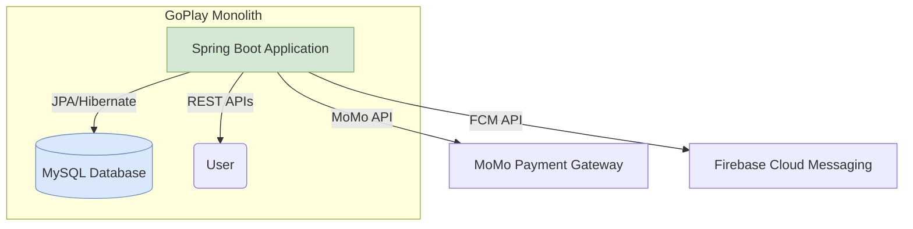
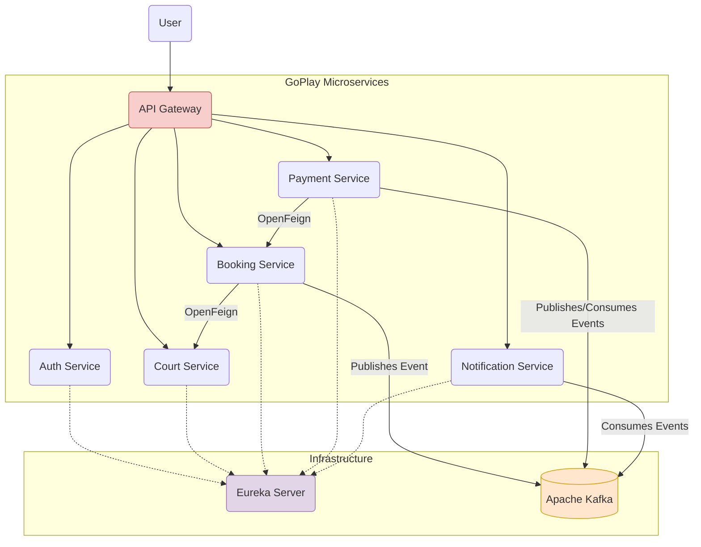

<div align="center">
  <h1>GoPlay - Real-Time Sports Venue Booking Platform</h1>
  <p>A comprehensive booking platform built with a modern microservices architecture, evolving from an initial monolithic design. This project demonstrates a full-stack solo development effort, covering everything from system design to deployment.</p>
  
  <p>
    
    
    
    
    
    
  </p>
</div>

---

## 📋 Table of Contents

- [📖 Overview](#-overview)
- [📸 Demo & Screenshots](#-demo--screenshots)
- [🏗️ System Architecture](#️-system-architecture)
  - [Phase 1: Monolithic Architecture](#phase-1-monolithic-architecture)
  - [Phase 2: Microservices Architecture](#phase-2-microservices-architecture)
  - [Communication Strategy: Kafka vs. OpenFeign](#communication-strategy-kafka-vs-openfeign)
- [🛠️ Tech Stack](#️-tech-stack)
- [✨ Key Features](#-key-features)
- [📂 Project Structure](#-project-structure)
- [🚀 Getting Started](#-getting-started)
  - [Prerequisites](#prerequisites)
  - [Installation & Setup](#installation--setup)
- [📚 API Documentation](#-api-documentation)
- [🧪 Testing](#-testing)
  - [Running Tests](#running-tests)
  - [Test Coverage](#test-coverage)
- [⚙️ Environment Variables](#️-environment-variables)
- [🤝 Contributing](#-contributing)
- [👨‍💻 Author](#-author)

---

## 📖 Overview

**GoPlay** is a real-time platform for booking sports venues like badminton courts and football fields. The project was developed entirely by me as a full-stack developer, showcasing a complete development lifecycle from concept to a scalable, production-ready system.

The project began as a **Monolithic application** (Phase 1) to rapidly build core features. It was later strategically refactored into a **Microservices architecture** (Phase 2) to enhance scalability, fault tolerance, and maintainability, using modern technologies like Apache Kafka, Spring Cloud Gateway, and Docker.

---

## 📸 Demo & Screenshots

*(placeholder) High-quality screenshots and GIF demos of the application flow will be added here soon.*

---

## 🏗️ System Architecture

The project's architecture evolved significantly to meet growing demands for scalability and resilience.

### Phase 1: Monolithic Architecture

Initially, GoPlay was built as a single, unified Spring Boot application. This allowed for rapid development and deployment of core functionalities.



### Phase 2: Microservices Architecture

To improve scalability and decouple components, the monolith was broken down into a set of independent, event-driven microservices.

- **Service Discovery:** All services register with the **Eureka Server**, allowing them to locate each other dynamically.
- **API Gateway:** **Spring Cloud Gateway** acts as the single entry point for all client requests, handling routing, authentication, and rate limiting.
- **Asynchronous Communication:** **Apache Kafka** is used for event-driven communication, ensuring services are loosely coupled and resilient to failures.
- **Synchronous Communication:** **OpenFeign** is used for direct, synchronous HTTP calls when an immediate response is required.



### Communication Strategy: Kafka vs. OpenFeign

The choice between asynchronous (Kafka) and synchronous (OpenFeign) communication was critical for system design.

#### Kafka (Asynchronous 🚀)
Used for processes that can be handled in the background without blocking the user. This "fire-and-forget" approach decouples services and improves fault tolerance.

- **Producer → Topic → Consumers Flow:**
  - `Booking Service` publishes a `booking.created` event to a Kafka topic.
  - `Payment Service` and `Notification Service` (consumers) both receive this event independently and trigger their respective workflows (e.g., create a payment record, send a confirmation email).

#### OpenFeign (Synchronous ⚡)
Used for requests that require an immediate response to proceed.
- **Example 1:** When a user tries to book a court, the `Booking Service` makes a synchronous call to the `Court Service` to check real-time slot availability. The booking process cannot continue without this confirmation.
- **Example 2:** The `Payment Service` calls the `Booking Service` to fetch booking details (like total price) before creating a payment link.

---

## 🛠️ Tech Stack

| Category                      | Technologies                                                                                             |
| ----------------------------- | -------------------------------------------------------------------------------------------------------- |
| **Backend**                   | `Java 21`, `Spring Boot 3`, `Spring Security`, `Spring Data JPA`, `Hibernate`                              |
| **Database**                  | `MySQL`                                                                                                  |
| **Microservices & Messaging** | `Apache Kafka`, `Spring Cloud Gateway`, `Eureka Service Discovery`, `OpenFeign`, `Redis` (for Caching)     |
| **Authentication**            | `JSON Web Tokens (JWT)`, `Role-Based Access Control (RBAC)`                                                |
| **Payment & Notifications**   | `MoMo API (IPN)`, `Firebase Cloud Messaging (FCM)`                                                         |
| **DevOps & Tools**            | `Docker`, `Docker Compose`, `Maven`                                                                        |
| **API & Documentation**       | `RESTful APIs`, `OpenAPI (Swagger)`                                                                        |
| **Testing**                   | `JUnit 5`, `Mockito`, `JaCoCo`                                                                           |

---

## ✨ Key Features

- ✅ **User Authentication**: Secure registration and login with JWT, including token refresh capabilities.
- ✅ **Role-Based Access Control (RBAC)**: Distinct permissions for `ADMIN` and `CUSTOMER` roles.
- ✅ **Court Management**: Full CRUD operations for sports venues, managed by admins.
- ✅ **Dynamic Search**: Advanced search and filtering for courts using JPA Specification (by name, location, sport type, etc.).
- ✅ **Booking System**: End-to-end booking flow, including creation, cancellation, and viewing user booking history.
- ✅ **Payment Integration**: Seamless payment processing via **MoMo API**, with real-time status updates using IPN webhooks.
- ✅ **Event-Driven Notifications**: Asynchronous push notifications (via FCM) and emails for events like booking confirmation and payment success, powered by **Apache Kafka**.
- ✅ **Scalable Architecture**: A resilient microservices system orchestrated with Docker Compose, ensuring high availability and independent scaling of services.

---

## 📂 Project Structure

The project is organized as a monorepo, with each microservice as a separate module.

```
GoPlay-Microservices-Backend/
├── 📁 Auth/             # Handles user authentication, authorization, and management
├── 📁 Booking/          # Manages booking logic, scheduling, and availability
├── 📁 Court/            # Manages court information, CRUD, and search
├── 📁 Notification/     # Sends emails and push notifications (FCM)
├── 📁 Payment/          # Processes payments via MoMo and manages transactions
├── 📁 SpringApiGateWay/ # The single entry point for all client requests
├── 📁 EurekaServer/     # Service discovery server
├── 📄 docker-compose.yml # Orchestrates all services and infrastructure (Kafka, Redis, etc.)
└── 📄 README.md
```

---

## 🚀 Getting Started

Follow these instructions to get the project up and running on your local machine.

### Prerequisites

- `Java 21`
- `Apache Maven`
- `Docker` and `Docker Compose`

### Installation & Setup

1.  **Clone the repository:**
    ```sh
    git clone https://github.com/NcP185204/GoPlay-Microservices-Backend.git
    cd GoPlay-Microservices-Backend
    ```

2.  **Configure Environment Variables:**
    - Create a `.env` file in the root directory by copying the `.env.example` template (see Environment Variables section).
    - Fill in your credentials for the database, JWT, MoMo, and Firebase.

3.  **Build all services:**
    ```sh
    mvn clean install
    ```

4.  **Run with Docker Compose:**
    This is the recommended way to run the entire system. This command will start all microservices and infrastructure containers (Kafka, Redis, MySQL).
    ```sh
    docker-compose up --build
    ```
    The API Gateway will be available at `http://localhost:8080`.

---

## 📚 API Documentation

API documentation is available via Swagger UI for each service. Once the services are running, you can access them at the following URLs:

| Service        | Swagger UI URL                                    |
| -------------- | ------------------------------------------------- |
| **Auth**       | `http://localhost:8081/swagger-ui/index.html`     |
| **Court**      | `http://localhost:8083/swagger-ui/index.html`     |
| **Booking**    | `http://localhost:8084/swagger-ui/index.html`     |
| **Payment**    | `http://localhost:8085/swagger-ui/index.html`     |
| **Notification**| `http://localhost:8086/swagger-ui/index.html`     |

---

## 🧪 Testing

Unit tests are written using JUnit 5 and Mockito to ensure the business logic in the service layer is robust and reliable.

### Running Tests

To run all tests across all modules, execute the following Maven command from the root directory:
```sh
mvn test
```

### Test Coverage

Code coverage is measured using **JaCoCo**. The primary focus was on testing the **service layer**, which contains the core business logic.

| Service        | Service Layer Coverage | Overall Coverage |
| :------------- | :--------------------: | :--------------: |
| **Auth**       |         `100%`         |      `27%`       |
| **Booking**    |         `75%`          |      `36%`       |
| **Payment**    |         `89%`          |      `68%`       |
| **Notification**|         `96%`          |      `66%`       |
| **Average**    |       **`~90%`**       |        -         |

*(Note: Overall coverage is lower as tests currently exclude controllers, configuration, and DTOs.)*

**(placeholder) A screenshot of the JaCoCo HTML report will be added here.**

---

## ⚙️ Environment Variables

To run this project, you need to configure the following environment variables. Create a `.env` file in the root directory with the following content:

```env
# DATABASE
DB_URL=jdbc:mysql://localhost:3306/your_db
DB_USERNAME=root
DB_PASSWORD=your_password

# JWT SECRET
JWT_SECRET_KEY=your_super_secret_jwt_key_with_at_least_256_bits

# MOMO PAYMENT
MOMO_PARTNER_CODE=your_momo_partner_code
MOMO_ACCESS_KEY=your_momo_access_key
MOMO_SECRET_KEY=your_momo_secret_key
MOMO_API_ENDPOINT=https://test-payment.momo.vn/v2/gateway/api/create

# FIREBASE
FIREBASE_CONFIG_PATH=path/to/your/goplay-firebase-adminsdk.json

# KAFKA
KAFKA_BOOTSTRAP_SERVERS=localhost:9092
```

---

## 🤝 Contributing

Contributions are welcome! If you have suggestions for improving the project, please feel free to create an issue or submit a pull request.

1.  **Fork** the repository.
2.  Create a new branch (`git checkout -b feature/YourFeature`).
3.  Make your changes and **commit** them (`git commit -m 'Add some feature'`).
4.  **Push** to the branch (`git push origin feature/YourFeature`).
5.  Open a **Pull Request**.

---

## 👨‍💻 Author

**Nguyễn Cao Phúc**

- **GitHub:** [@NcP185204](https://github.com/NcP185204)
- **Email:** `nguyencaophuc.204@gmail.com`
